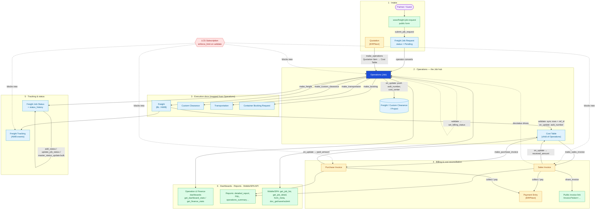

# Forwarding App — Functional Flow

A freight-forwarding / LCS (Logistics Cloud System) Frappe app. **Operations** (the Job)
is the hub: leads/requests flow into it, execution docs (Freight, Custom Clearance,
Transportation, Booking) and invoices are spun out of it, and its `billing_status` is
derived back from those invoices. Everything is gated by an **LCS Subscription** plan.

## End-to-end flow

## Reading the flow

| Phase | What happens | Key code |
|-------|--------------|----------|
| **1 Intake** | Partners submit the public job-request form; ERPNext Quotations are mapped into jobs. | `api.submit_job_request`, `custom_methods.make_operations` |
| **2 Job hub** | `Operations` is the spine. `validate` derives `billing_status` from its invoices; `on_update` pushes `awb_number`/`cost_center` onto Freight, Custom Clearance, Project. | `operations.Operations.validate / set_billing_status / on_update` |
| **3 Execution** | Freight, Custom Clearance, Transportation, Container Booking are `get_mapped_doc` spin-offs. Freight syncs its rows back into the Operations **Cost Table** (creating `ref_id` links). | `operations.make_freight/…`, `freight.Freight.validate` |
| **4 Billing** | Cost Table rows become Sales/Purchase Invoice lines. Invoice `on_update` writes `received_amount`/`paid_amount` back to the Cost Table; `on_cancel` reverses. Invoices can be shared via a public token link. | `operations.make_sales_invoice/make_purchase_invoice`, `custom_methods.update_cost_table_in_operations`, `api.share_invoice` |
| **5 Tracking** | `Freight Tracking` holds AWB/BL events; `Freight Job Status` keeps a `status_history` child log, updatable singly or in bulk. | `api.track_awb / update_job_status / master_status_update`, `freight_job_status.add_status` |
| **6 Views** | Dashboards/reports aggregate jobs & invoices; a generic CRUD + form-meta API backs the mobile/SPA front end. | `api.get_dashboard_stats / get_finance_stats / form_meta / doc_save` |
| **Cross-cutting** | Every new `Operations`, `Sales/Purchase Invoice`, `Freight Voucher`, `Freight Tracking` is checked against the active **LCS Subscription** plan limit. Customers/Suppliers get auto `CU-/SU-` codes on insert. | `subscription.enforce_limit`, `naming.set_customer_code/set_supplier_code` |

> The diagram is Mermaid — it renders in the GitHub/VS Code preview and most Markdown viewers.
